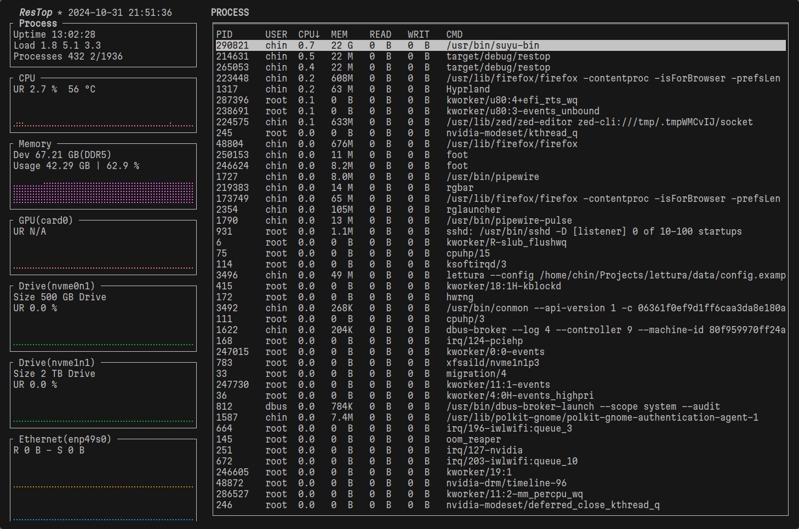
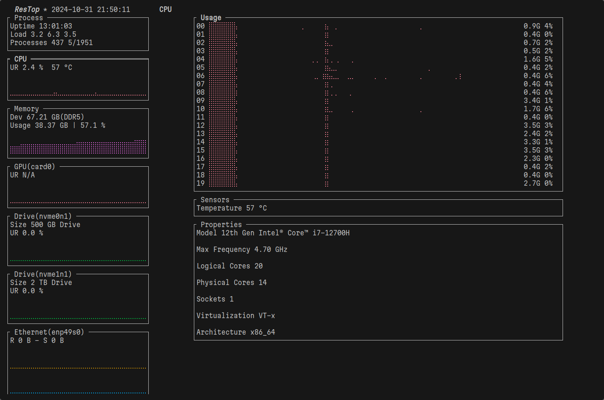
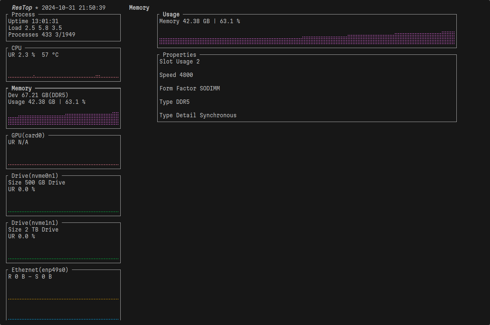
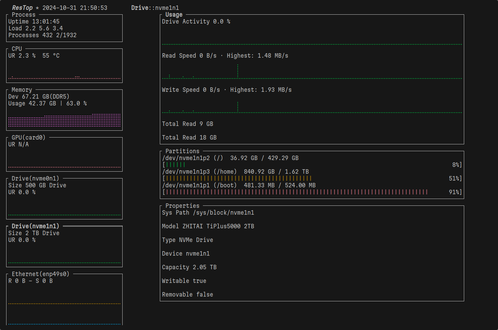
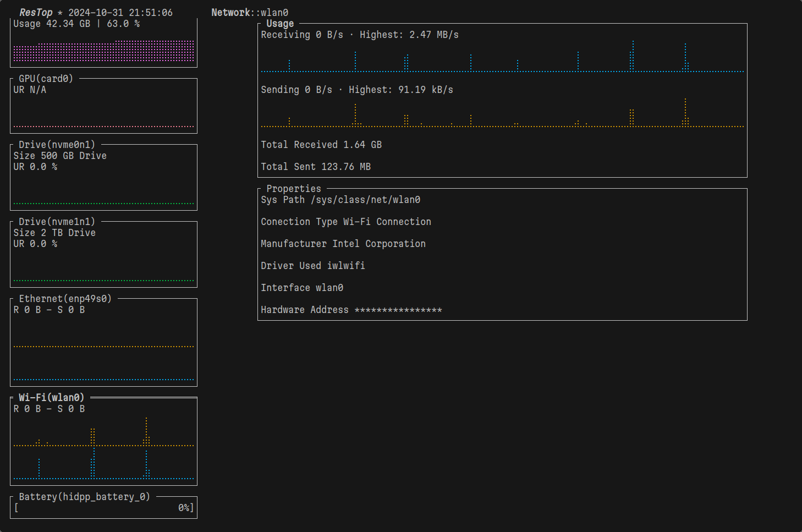
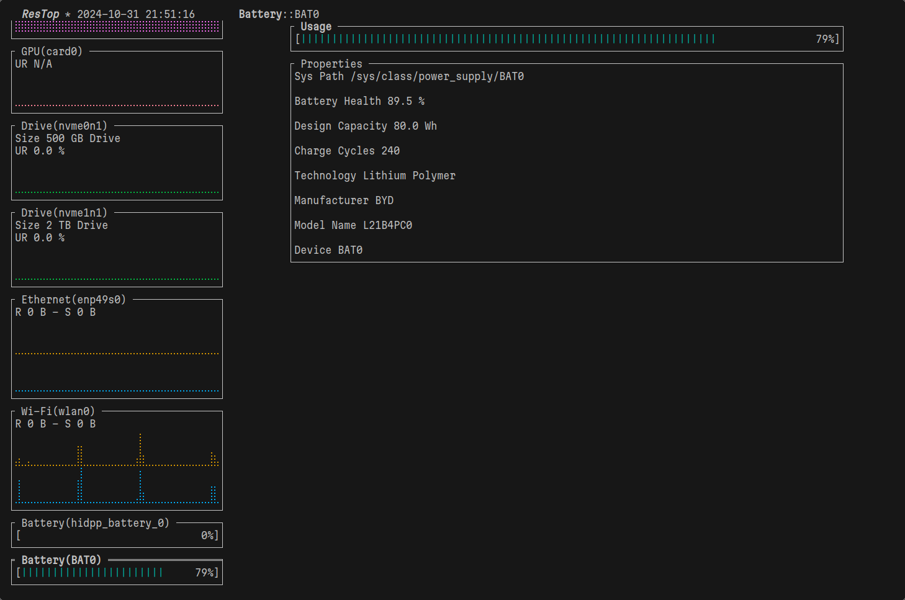

# Preview
## Processes

## CPU

## Memory

## Disk

## Network

## Battery

# Why wrote this.
I like the design of https://github.com/nokyan/resources and https://missioncenter.io/, but I wanted to use them in a terminal, so I forked this tui tool based on resources.

# Credits
    - resources: https://github.com/nokyan/resources
    - btm: https://github.com/ClementTsang/bottom
    - missioncenter: https://missioncenter.io/
